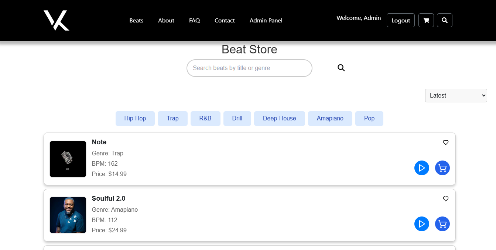

# Beat Store Application

This application is a modern and user-friendly beat/music store built using the **MERN Stack** technologies. It allows users to browse, play, and purchase beats seamlessly.  

 **🌐** [Live link](https://vinkid-beatz.onrender.com/)  
📧 **Contact Me**: alvinzondi09@gmail.com  

---
## 📸 Screenshot

---

## ✨ Features

- 🎧 **Play Beats**: Users can preview beats directly on the website.  
- 🔐 **User Authentication**: Login and register functionalities for a personalized experience.  
- 💳 **Purchase Beats**: Secure checkout process using **Stripe**.  
- 📱 **Responsive Design**: Fully optimized for various devices.  
- 🎨 **Tailwind CSS Styling**: Clean, modern UI built with Tailwind for layout and components.  
- 🔘 **Bootstrap Buttons**: Buttons styled with Bootstrap for consistency and simplicity. 

---

## How to Use the Application

1. **Browse Beats** – Anyone can play beats without an account.  
2. **Create an Account** – Required to purchase beats.  
3. **Login** – Access additional features like purchasing.  
4. **Purchase Beats** – Add beats to the cart and checkout securely with **Stripe**.  

---

## Navigation

The app consists of **9 main pages**:  

- Home – Overview of the beat store.  
- Beats – Browse and play available beats.  
- Register – Create a new account.  
- Login – Access your account.  
- Cart – View selected beats.  
- Checkout – Secure payment via Stripe.  
- Profile – Manage account details.  
- Contact – Reach out for inquiries.  
- About – Learn more about the app.  

---

## Technologies Used

- **MongoDB** – Database for user and beat information.  
- **Express.js** – Backend framework.  
- **React.js** – Frontend library.  
- **Node.js** – Runtime environment.  
- **Stripe** – Payment processing.  
- **Tailwind CSS** – Modern styling.  
- **Bootstrap** – Button components.  
- **Redux** – Global state management (for audio controls).  

---

## Challenges I Faced & How I Overcame Them

Building this Beat Store came with several challenges:  

- **Stripe Integration** – Understanding API keys and webhooks was tricky. I solved this by carefully following Stripe’s documentation and testing in *test mode*.  
- **File Uploads** – Managing beat uploads and serving them properly was a challenge. I used **multer** and **express.static** to handle it.  
- **Admin Login Issues** – Differentiating between admins and normal users was difficult at first. I added an **isAdmin flag** in the database, applied middleware, and restricted routes/features based on roles.  
- **Styling Conflicts** – Tailwind and Bootstrap sometimes overlapped. I fixed this by using Bootstrap only for buttons and Tailwind for layouts.  
- **Deployment on Render** – Environment variables caused issues initially. I solved this by properly configuring **MONGO_URI**, **JWT_SECRET**, and **STRIPE_SECRET_KEY** in Render’s dashboard.  
- **Authentication Flow** – JWT tokens weren’t stored/validated correctly at first. I fixed this with **localStorage** in React and middleware validation in the backend.  
- **Audio Controls Across Pages** – Playback stopped when switching routes. I implemented **Redux** for global state management so the audio player could persist across pages.  

These challenges taught me how to debug effectively, read documentation carefully, and design smooth full-stack features.  

---
✅ Thank you for checking out my project!  
